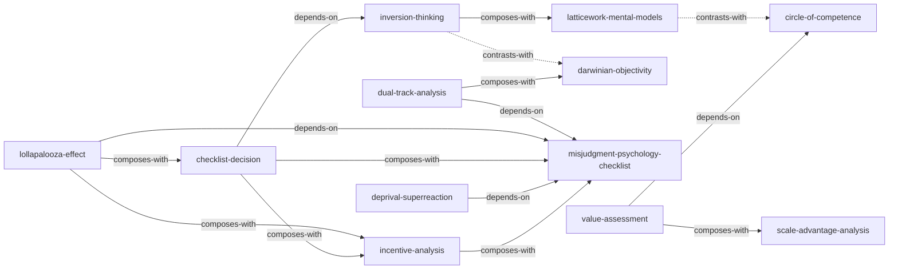

# 《穷查理宝典》— Skill Index

> 本书由 book2skill 蒸馏, 共产出 **12** 个 skills。
> 处理时间: 2026-04-15

## 关于这本书
- **作者**: 查理·芒格 (彼得·考夫曼编)
- **出版年**: 2005/2010
- **一句话主旨**: 通过跨学科思维模型和逆向思考,构建避免愚蠢的普世决策框架
- **整书理解**: 见 [BOOK_OVERVIEW.md](./BOOK_OVERVIEW.md)

---

## Skill 列表 (按主题分组)

### 核心思维方法
- [`inversion-thinking`](./inversion-thinking/SKILL.md) -- 逆向思维：不问"如何成功"，先系统性地追问"什么会导致失败"，通过避免愚蠢来获得成功
- [`latticework-mental-models`](./latticework-mental-models/SKILL.md) -- 多元思维模型框架：从数学、工程、物理、化学、生物、心理学、经济学等核心学科提取约100个基本模型，组合使用解决实际问题
- [`darwinian-objectivity`](./darwinian-objectivity/SKILL.md) -- 达尔文极端客观性：观点越让自己信服，就越要刻意寻找反面证据，系统性地对抗确认偏见和避免不一致性倾向
- [`circle-of-competence`](./circle-of-competence/SKILL.md) -- 能力圈判断：认清自己真正能做出准确判断的知识边界，"没有边界的能力根本不能称之为能力"

### 认知偏差防范
- [`dual-track-analysis`](./dual-track-analysis/SKILL.md) -- 双轨分析：同时在理性分析轨道和潜意识心理学轨道上运行决策，检查判断是否被认知偏差扭曲
- [`misjudgment-psychology-checklist`](./misjudgment-psychology-checklist/SKILL.md) -- 误判心理学检查清单：25种导致人类判断错误的心理倾向的逐一排查工具，决策前逐项自审
- [`lollapalooza-effect`](./lollapalooza-effect/SKILL.md) -- Lollapalooza 效应识别：多种心理倾向或外部力量同时朝同一方向作用时产生的非线性爆发效应
- [`incentive-analysis`](./incentive-analysis/SKILL.md) -- 激励机制分析：理解任何人类行为的第一步是分析激励机制——谁有什么激励，被激励去做什么
- [`deprival-superreaction`](./deprival-superreaction/SKILL.md) -- 被剥夺超级反应倾向防范：识别和防范因失去(或即将失去)某样东西而产生的不成比例的激烈反应

### 投资与商业分析
- [`value-assessment`](./value-assessment/SKILL.md) -- 价值评估原则：以"合理的价格买入伟大企业"为核心，综合评估护城河、安全边际、定价权、管理层和能力圈
- [`scale-advantage-analysis`](./scale-advantage-analysis/SKILL.md) -- 规模优势/劣势分析：同时在两个方向上评估规模的影响——几何效应、信息优势、专业化、寡头垄断、网络效应 vs 官僚主义、僵化、腐败

### 综合执行框架
- [`checklist-decision`](./checklist-decision/SKILL.md) -- 检查清单决策：将所有思维模型、失败案例教训和心理偏差编排为系统化的决策前核对列表，强制执行以防止遗漏

---

## 引用图



图例: `-->` depends-on, `-.->` contrasts-with, `==>` composes-with

---

## 推荐学习顺序

1. **inversion-thinking** -- 最基础，无前置。芒格体系的入口："反过来想，总是反过来想。"
2. **latticework-mental-models** -- 掌握分析工具箱。理解"铁锤人倾向"的危害，学会跨学科组合模型。
3. **circle-of-competence** -- 划定行动边界。知道"你不知道什么"比知道什么更重要。
4. **darwinian-objectivity** -- 建立验证习惯。形成观点后，训练自己优先寻找反面证据。
5. **misjudgment-psychology-checklist** -- 掌握25种心理倾向全景。这是后续多个 skill 的共同基础。
6. **dual-track-analysis** -- 学会在决策中同时运行理性轨道和心理学轨道。
7. **incentive-analysis** -- 深入理解25种倾向中最重要的一种：激励机制如何驱动行为。
8. **lollapalooza-effect** -- 理解极端事件的成因：多种力量同方向叠加的非线性爆发。
9. **deprival-superreaction** -- 专项深入一种高频偏差：损失带来的不成比例反应。
10. **checklist-decision** -- 综合执行框架。将前面所有 skill 的产物编排为强制执行的决策前核对列表。
11. **scale-advantage-analysis** -- 商业分析专用工具。评估规模的双刃剑效应。
12. **value-assessment** -- 投资决策专用工具。综合运用能力圈+规模分析+安全边际评估内在价值。

---

## 接入 darwin-skill

每个 skill 目录下的 `SKILL.md` 均遵循统一的 RIA++ 格式 (Reading / Interpretation / Application / Execution / Boundary)，可直接被 darwin-skill 框架加载。接入方式：

1. **自动发现**: 将本书目录路径加入 darwin-skill 的 `skill_paths` 配置，框架自动扫描所有 `*/SKILL.md`
2. **手动注册**: 在 darwin-skill 的 `skills.yaml` 中按 slug 注册每个 skill
3. **关系图加载**: 框架读取每个 SKILL.md 的 `related_skills` 字段构建 skill 间引用图，支持级联触发

```yaml
# skills.yaml 示例
book: poor-charlies-almanack-skill
skills:
  - slug: inversion-thinking
    path: ./inversion-thinking/SKILL.md
    tags: [逆向思维, 决策, 风险规避]
  - slug: latticework-mental-models
    path: ./latticework-mental-models/SKILL.md
    tags: [跨学科思维, 思维模型]
  # ... 其余 10 个 skill
```

---

## 审计轨迹

| 阶段 | 产出 | 状态 |
|---|---|---|
| 阶段 0: Adler 整书理解 | BOOK_OVERVIEW.md | done |
| 阶段 1: 候选方法论提取 | 5 个 sub-agent 并行 | done |
| 阶段 1.5: 三重验证筛选 | V1 跨域 / V2 预测力 / V3 独特性 | done |
| 阶段 2: RIA++ 构造 | 12 个 SKILL.md | done |
| 阶段 3: Zettelkasten 链接 | INDEX.md + related_skills | done |
| 阶段 4: 压力测试 | test-prompts.json | pending |

**关系统计**: 15 条关系 (5 depends-on / 2 contrasts-with / 8 composes-with)
**蒸馏时间**: 2026-04-15
